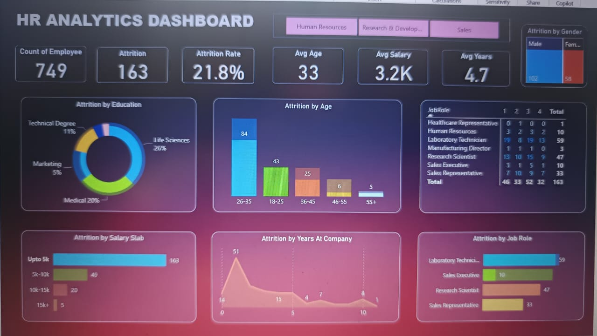

# HR-Analytics-Dashboard-PowerBI
"A Power BI dashboard analyzing employee attrition trends"

## 📊 Overview  
This dashboard analyzes employee attrition trends using Power BI, helping HR teams identify risk factors.

## 🔍 Key Insights  
- Employees at 1-2 years tenure are most likely to quite  
- Employees aged 20-30 leave 40% more often  
- Lower salary brackets show 2x attrition rate
- Sales roles show 26% Attrition rate higher than average Attrition rate  

## 🛠️ How It Was Built  
1. Data cleaning in Power Query  
2. DAX measures for attrition rate  
3. Interactive visuals (donut charts, treemaps,matrix,bar charts)  

## 📸 Dashboard Preview  
  

## 💡 How to Use  
1. Download the HR ANALYTICS(KUNAL).pbix file  
2. Open in Power BI Desktop  
3. Explore filters and insights
